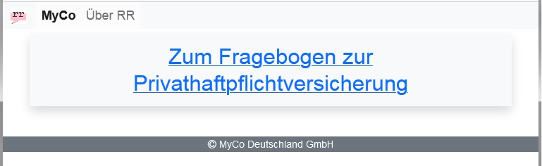
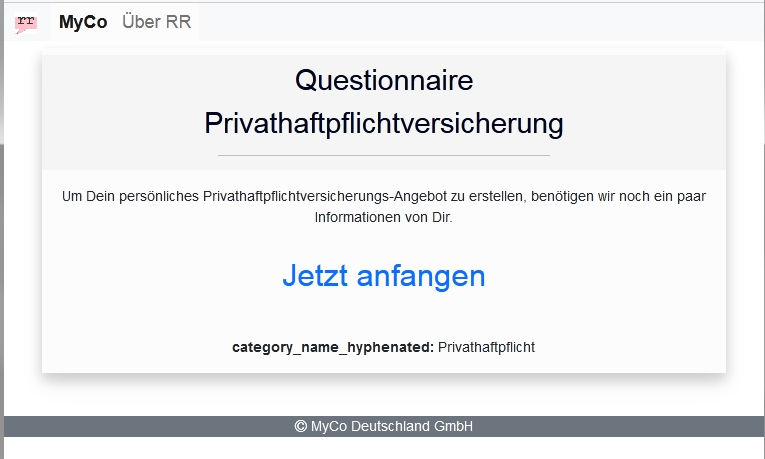
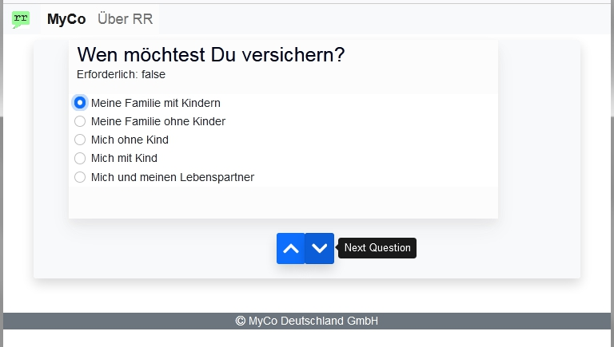
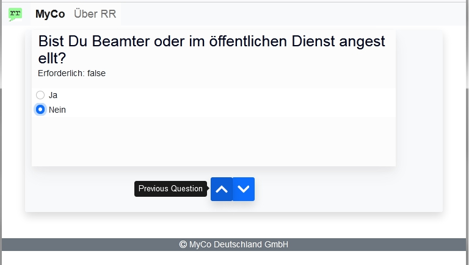
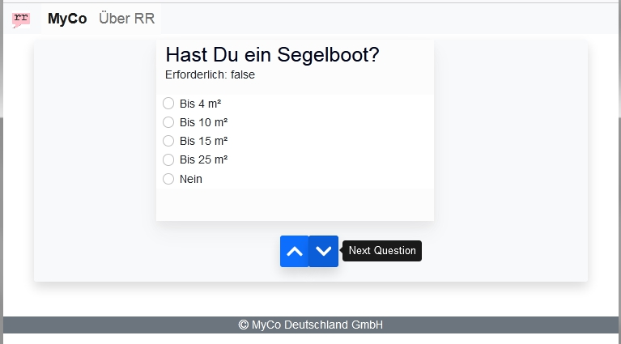
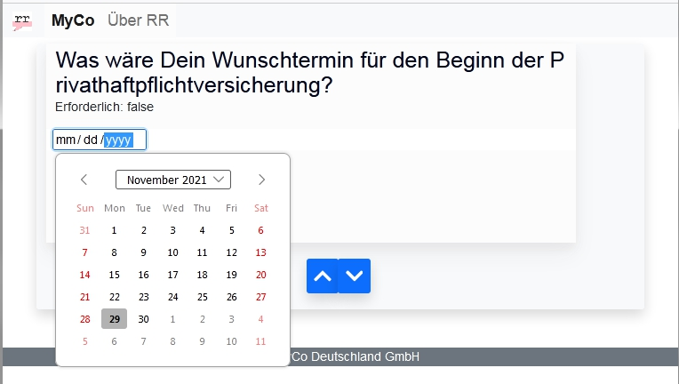
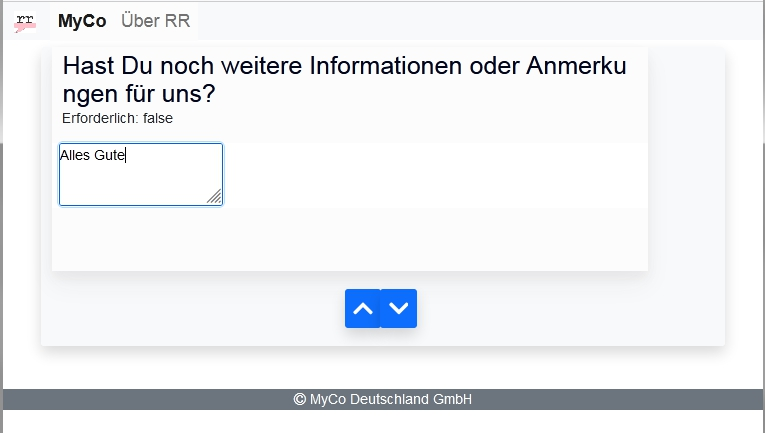
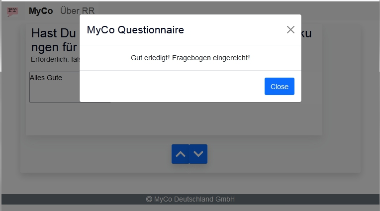

# RR Shopware
Visit us at:
Will add public URL soon.

Until then, you may deploy on your own local environment and test.

## RR Shopware site built with:
- Ember.js
- Modern JavaScript / ECMAScript (ES6+)
- CSS
- HTML
- Bootstrap
- Fonts

## Questionnaire wizard with functionalities:
- Navbar and Header title
- Welcome page
- Footer
- Start page with the link to start the questionnaire
- Beautiful radio buttons
- Next/Previous buttons to navigate among questions. Answers will be retained as answered/unanswered while navigating.
- Question box size animation "Ember Animated"
- Calendar compontent
- Freetext multiline textarea component
- In-page popup (snackbar/toast) inspired from Material UI. Again thanks to Bootstrap developers!

## Screenshots

  
Welcome Page, Navbar in Header and Footer  

  
Start Page to Start the Questionnaire  

Beautiful Radio Buttons and Next Question Button  

  
Previous Question Button  

  
Unanswered Question  

  
Calendar as Date Picker  

  
Textarea Input  

  
Beautiful Popup from Bootstrap  

## Thanks for reviewing. Feedback is welcome!